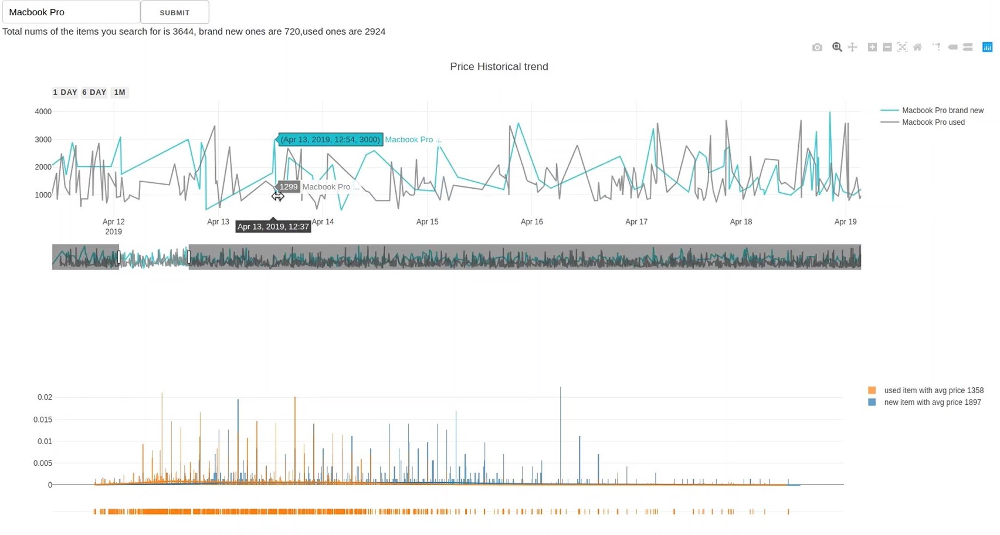
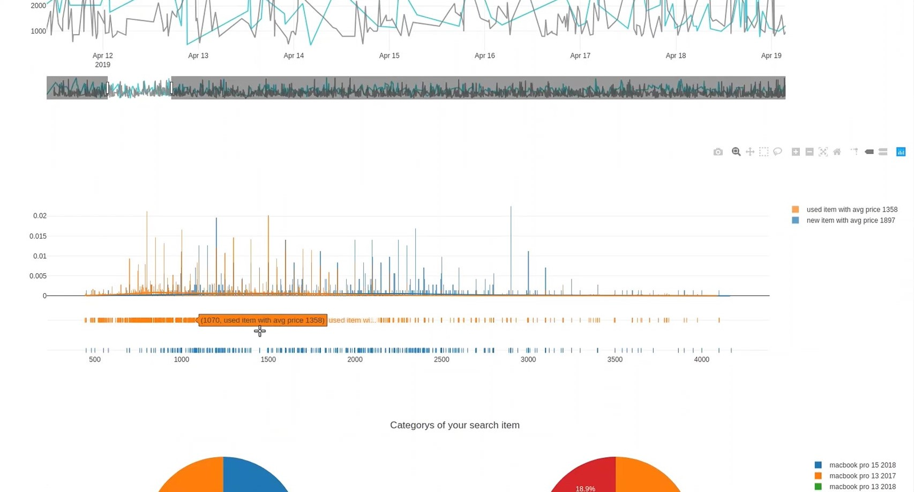
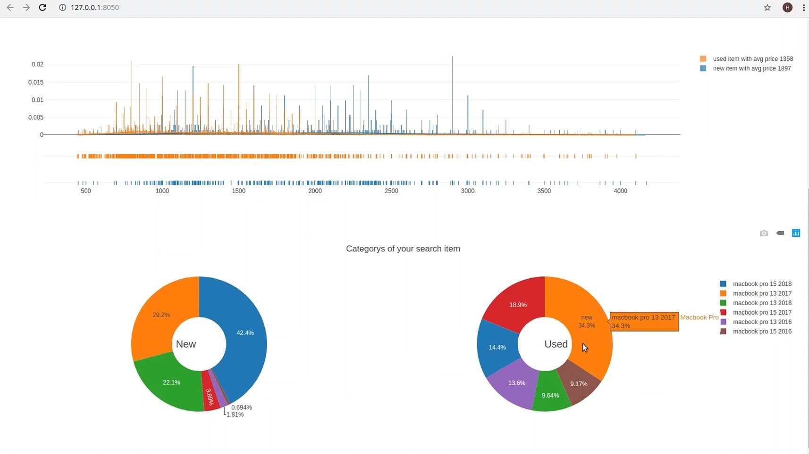

# Ebay-eyes 

A tool to help customers buy better at eBay. 

## Intro

Find items at eBay is easy, just search:

But what would you get are only
endless pages and results.
 
You may wonder, can I compare current price with historical price? Is the price which I see here is good or not? how many items in the market now?
 
Well, if you have these questions before, this tool is going to help you solve them.
 
## Solution  
Here is how it works:

whenever you search something,
It provides the following information based on item condition(used or new):
1. Historical price data
2. Price distribution with average price 
3. more information of search item

With this tool, you are able to have a better idea of the item you are interested.

 
## DataSource
Data source are provided by calling eBay API

## Architecture

- Call ebay API to request the historical and transaction data from ebay, the data is stored at S3 bucket.
- Cleansing the data to extract most important information- price, transaction date, category id,etc.
- Build a database to store the information from last step- including two tables,item table and transaction teble
- Interactive dashboard using Dash and plotly
- Daily update on database using crontab + Python  

## Demo

Demo can be found [here](https://www.youtube.com/watch?v=fZerV4U1RZY&t=2s)

